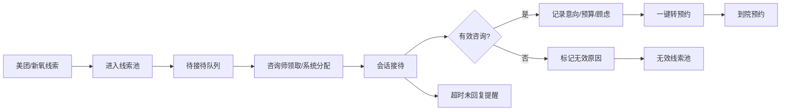
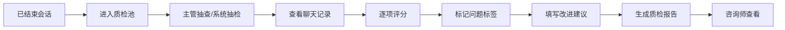
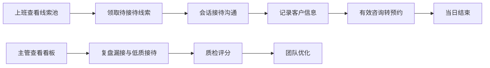

# 医美机构线索接待台 PRD

## 1. 产品概述

医美机构线索接待台是专为医美机构运营团队打造的统一线索管理平台，解决美团、新氧等多平台咨询入口分散、客服抢单混乱的核心问题。通过线索统一接入、智能分配、标准化接待和数据化复盘，提升咨询转化率和团队协作效率。

- **目标用户**：医美机构咨询师、咨询主管、运营经理
- **核心价值**：线索统一池化管理、智能分配避免抢单、标准化接待提升转化、数据化管理持续优化

## 2. 核心功能

### 2.1 用户角色

| 角色 | 登录方式 | 核心权限 |
|------|----------|----------|
| 咨询师 | 账号密码登录 | 领取/接待线索、会话沟通、创建预约、查看客户档案 |
| 主管 | 账号密码登录 | 全部咨询师权限 + 质检评分、查看看板、线索分配调整、团队数据统计 |
| 管理员 | 账号密码登录 | 全部权限 + 账号管理、系统配置、话术管理 |

### 2.2 功能模块

1. **线索池**：美团/新氧线索统一接入、待接待队列、已分配线索、超时提醒、无效线索标记
2. **会话接待**：实时聊天、快捷话术、顾客信息侧栏、意向项目标签、预算/顾虑记录、转预约
3. **客户档案**：客户信息管理、咨询历史、到院记录、消费记录、标签管理
4. **到院预约**：预约列表、预约详情、到院确认、取消/改约、未到院跟进
5. **质检复盘**：聊天记录抽查、接待评分、质检报告、问题标签、改进建议
6. **主管看板**：实时数据概览、线索统计、转化漏斗、咨询师排名、漏接预警

### 2.3 页面详情

| 页面名称 | 模块名称 | 功能描述 |
|----------|----------|----------|
| 登录页 | 登录表单 | 账号密码登录、记住密码、忘记密码 |
| 线索池 | 待接待列表 | 显示平台来源、意向项目、咨询时间、等待时长、一键领取 |
| 线索池 | 已接待列表 | 显示接待咨询师、当前状态、最后回复时间 |
| 线索池 | 全部线索 | 线索筛选、搜索、批量操作 |
| 会话接待 | 会话列表 | 左侧会话列表、未读消息数、会话状态标签 |
| 会话接待 | 聊天窗口 | 消息气泡、时间显示、发送状态、快捷话术面板 |
| 会话接待 | 客户信息栏 | 右侧显示客户资料、意向项目、预算、顾虑点、历史记录 |
| 客户档案 | 档案列表 | 客户搜索、标签筛选、消费等级 |
| 客户档案 | 档案详情 | 基本信息、咨询记录、到院记录、消费记录、标签管理 |
| 到院预约 | 预约日历 | 日历视图、每日预约数、时段分布 |
| 到院预约 | 预约列表 | 列表视图、状态筛选、批量操作 |
| 到院预约 | 预约详情 | 客户信息、预约项目、咨询师、到院状态 |
| 质检复盘 | 质检列表 | 待质检、已质检、质检评分筛选 |
| 质检复盘 | 质检详情 | 聊天记录查看、评分项、问题标签、评语 |
| 主管看板 | 数据概览 | 今日线索数、接待数、预约数、转化率、平均响应时长 |
| 主管看板 | 漏斗图 | 线索→接待→有效咨询→预约→到院 转化漏斗 |
| 主管看板 | 咨询师排名 | 按接待量、转化率、满意度等维度排名 |
| 主管看板 | 实时监控 | 待接待数、超时限、在线咨询师数 |

## 3. 核心流程

### 3.1 线索接待流程

### 3.2 质检流程

### 3.3 每日工作流

## 4. 用户界面设计

### 4.1 设计风格

**设计定位**：专业、高效、精致的医疗美容行业SaaS产品界面

- **主色调**：深玫瑰金 #B76E79（医美行业代表色，专业优雅）
- **辅助色**：
  - 美团橙 #FF8200（标识美团来源线索）
  - 新氧绿 #00C853（标识新氧来源线索）
  - 成功绿 #10B981（预约成功、到院确认）
  - 警示红 #EF4444（超时提醒、紧急线索）
  - 中性灰 #6B7280（次要信息）
- **背景色**：暖灰白 #FAFAF9（主背景）、纯白 #FFFFFF（卡片）
- **字体**：
  - 标题：Noto Serif SC（优雅衬线体，体现医美精致感）
  - 正文：Noto Sans SC（清晰易读的无衬线体）
- **按钮风格**：圆角中等（6px）、精致阴影、悬停微放大效果
- **布局风格**：左侧导航 + 主内容区 + 右侧详情面板的三栏布局
- **图标风格**：线性图标，精致描边，统一2px线宽

### 4.2 页面设计概览

| 页面名称 | 模块名称 | UI元素 | 设计亮点 |
|----------|----------|--------|----------|
| 线索池 | 顶部筛选栏 | 平台筛选、项目筛选、时间筛选、搜索框 | 标签式筛选，选中态有渐变背景 |
| 线索池 | 线索卡片列表 | 平台标识、客户头像、意向项目标签、等待时长、领取按钮 | 超时线索红色脉动边框动画 |
| 会话接待 | 会话列表 | 头像、名称、最新消息、未读数、平台标识 | 未读消息红点跳动动画 |
| 会话接待 | 聊天区域 | 消息气泡、时间戳、快捷话术面板、输入框 | 消息入场平滑动画，快捷话术分类标签 |
| 会话接待 | 客户信息侧栏 | 基本信息、意向项目、预算、顾虑点、历史记录 | 可折叠面板，信息分组清晰 |
| 主管看板 | 数据卡片 | 指标名称、数值、环比趋势、目标进度 | 渐变背景卡片，数据入场计数动画 |
| 主管看板 | 转化漏斗 | 五段漏斗图、转化率标注 | 渐变色漏斗，悬停显示详细数据 |
| 主管看板 | 排名列表 | 排名、咨询师姓名、指标值、趋势箭头 | 前三名金色/银色/铜色标识 |

### 4.3 响应式设计

- **桌面端优先**：针对1920×1080及以上分辨率优化
- **平板适配**：1024px以上保持三栏布局，适当压缩间距
- **移动端**：768px以下简化为单栏布局，底部Tab导航
- **触控优化**：移动端按钮最小44px点击区域，列表项增加触控反馈

### 4.4 动效与交互

- **页面切换**：淡入淡出 + 轻微位移动画，时长200ms
- **卡片悬停**：上移2px + 阴影加深，时长150ms
- **数据加载**：骨架屏占位，内容渐入
- **通知提醒**：右侧滑入，停留3秒后滑出
- **超时线索**：红色边框呼吸脉动动画，吸引注意
- **新消息**：轻微缩放弹跳，未读数红点脉冲
