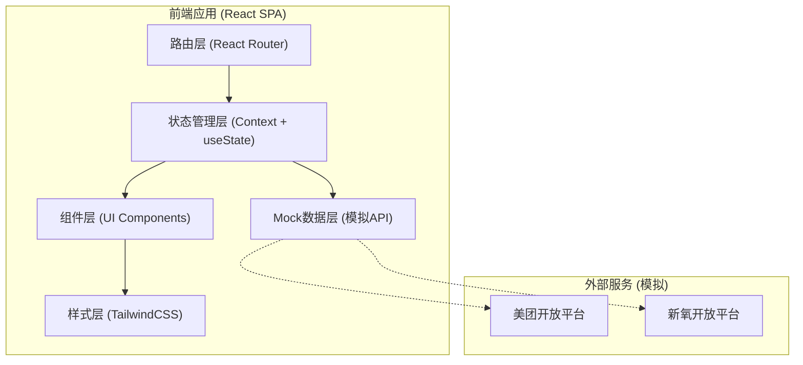
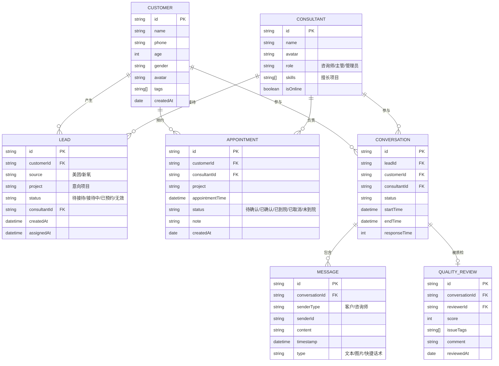

# 医美机构线索接待台 技术架构文档

## 1. 架构设计



## 2. 技术描述

- **前端框架**：React@18 + TypeScript
- **构建工具**：Vite@5
- **样式方案**：TailwindCSS@3
- **路由管理**：React Router@6
- **状态管理**：React Context + useState（轻量级状态管理）
- **图标库**：Lucide React（线性图标，符合设计风格）
- **图表库**：Recharts（数据可视化，转化漏斗、趋势图）
- **日期处理**：dayjs（轻量级日期库）
- **Mock数据**：本地JSON + Mock Service Worker（模拟API请求）

## 3. 路由定义

| 路由路径 | 页面名称 | 模块 | 访问权限 |
|----------|----------|------|----------|
| `/login` | 登录页 | 认证 | 公开 |
| `/` | 线索池 | 线索池 | 咨询师/主管 |
| `/leads/pool` | 待接待线索 | 线索池 | 咨询师/主管 |
| `/leads/all` | 全部线索 | 线索池 | 咨询师/主管 |
| `/conversation` | 会话接待 | 会话接待 | 咨询师/主管 |
| `/conversation/:id` | 会话详情 | 会话接待 | 咨询师/主管 |
| `/customers` | 客户档案 | 客户档案 | 咨询师/主管 |
| `/customers/:id` | 客户详情 | 客户档案 | 咨询师/主管 |
| `/appointments` | 到院预约 | 到院预约 | 咨询师/主管 |
| `/appointments/calendar` | 预约日历 | 到院预约 | 咨询师/主管 |
| `/quality` | 质检复盘 | 质检复盘 | 主管 |
| `/quality/:id` | 质检详情 | 质检复盘 | 主管 |
| `/dashboard` | 主管看板 | 主管看板 | 主管 |

## 4. 数据模型

### 4.1 数据模型ER图



### 4.2 核心数据类型定义

```typescript
// 客户信息
interface Customer {
  id: string;
  name: string;
  phone: string;
  age: number;
  gender: 'female' | 'male';
  avatar: string;
  tags: string[];
  budget?: string;
  concerns?: string[];
  createdAt: string;
}

// 线索
interface Lead {
  id: string;
  customerId: string;
  customer: Customer;
  source: 'meituan' | 'xinyang';
  project: string;
  projectCategory: 'rhinoplasty' | 'skin' | 'antiaging' | 'breast' | 'body' | 'other';
  status: 'pending' | 'assigned' | 'in_conversation' | 'appointed' | 'invalid';
  consultantId?: string;
  consultant?: Consultant;
  createdAt: string;
  assignedAt?: string;
  waitTime?: number;
  invalidReason?: string;
}

// 咨询师
interface Consultant {
  id: string;
  name: string;
  avatar: string;
  role: 'consultant' | 'supervisor' | 'admin';
  skills: string[];
  isOnline: boolean;
  todayLeadsCount: number;
  conversionRate: number;
}

// 会话
interface Conversation {
  id: string;
  leadId: string;
  customer: Customer;
  consultant: Consultant;
  status: 'active' | 'ended';
  startTime: string;
  endTime?: string;
  lastMessage?: string;
  lastMessageTime?: string;
  unreadCount: number;
  responseTime?: number;
}

// 消息
interface Message {
  id: string;
  conversationId: string;
  senderType: 'customer' | 'consultant';
  senderId: string;
  content: string;
  timestamp: string;
  type: 'text' | 'image' | 'quick_reply';
  quickReplyTag?: string;
}

// 快捷话术
interface QuickReply {
  id: string;
  category: string;
  tag: string;
  content: string;
}

// 预约
interface Appointment {
  id: string;
  customerId: string;
  customer: Customer;
  consultantId: string;
  consultant: Consultant;
  project: string;
  appointmentTime: string;
  status: 'pending' | 'confirmed' | 'arrived' | 'cancelled' | 'no_show';
  note?: string;
  createdAt: string;
}

// 质检记录
interface QualityReview {
  id: string;
  conversationId: string;
  conversation: Conversation;
  reviewerId: string;
  reviewer: Consultant;
  score: number;
  dimensions: {
    responseSpeed: number;
    professionalism: number;
    serviceAttitude: number;
    conversionSkill: number;
  };
  issueTags: string[];
  comment: string;
  reviewedAt: string;
}

// 看板数据
interface DashboardData {
  todayStats: {
    totalLeads: number;
    receivedLeads: number;
    validConsultations: number;
    appointments: number;
    arrivals: number;
    conversionRate: number;
    avgResponseTime: number;
  };
  funnelData: { stage: string; value: number; rate: number }[];
  consultantRanking: {
    id: string;
    name: string;
    avatar: string;
    leadsCount: number;
    conversionRate: number;
    avgScore: number;
  }[];
  realtimeMonitor: {
    pendingLeads: number;
    timeoutLeads: number;
    onlineConsultants: number;
    busyConsultants: number;
  };
}
```

## 5. 项目目录结构

```
src/
├── assets/              # 静态资源
│   └── images/
├── components/          # 通用组件
│   ├── layout/         # 布局组件
│   │   ├── Sidebar.tsx
│   │   ├── Header.tsx
│   │   └── Layout.tsx
│   ├── ui/             # 基础UI组件
│   │   ├── Button.tsx
│   │   ├── Card.tsx
│   │   ├── Badge.tsx
│   │   ├── Avatar.tsx
│   │   ├── Input.tsx
│   │   ├── Select.tsx
│   │   ├── Modal.tsx
│   │   └── Tabs.tsx
│   └── common/         # 业务组件
│       ├── LeadCard.tsx
│       ├── CustomerInfo.tsx
│       └── StatCard.tsx
├── pages/              # 页面组件
│   ├── Login/
│   ├── LeadPool/
│   │   ├── PendingLeads.tsx
│   │   ├── AllLeads.tsx
│   │   └── components/
│   ├── Conversation/
│   │   ├── ConversationList.tsx
│   │   ├── ChatWindow.tsx
│   │   ├── QuickReplies.tsx
│   │   └── CustomerSidebar.tsx
│   ├── Customers/
│   │   ├── CustomerList.tsx
│   │   └── CustomerDetail.tsx
│   ├── Appointments/
│   │   ├── AppointmentList.tsx
│   │   ├── AppointmentCalendar.tsx
│   │   └── AppointmentDetail.tsx
│   ├── Quality/
│   │   ├── QualityList.tsx
│   │   └── QualityDetail.tsx
│   └── Dashboard/
│       ├── StatsOverview.tsx
│       ├── FunnelChart.tsx
│       ├── ConsultantRanking.tsx
│       └── RealtimeMonitor.tsx
├── hooks/              # 自定义Hooks
│   ├── useLeads.ts
│   ├── useConversations.ts
│   └── useDashboard.ts
├── data/               # Mock数据
│   ├── leads.ts
│   ├── customers.ts
│   ├── consultants.ts
│   ├── conversations.ts
│   ├── messages.ts
│   ├── quickReplies.ts
│   ├── appointments.ts
│   └── dashboard.ts
├── types/              # TypeScript类型定义
│   └── index.ts
├── utils/              # 工具函数
│   ├── date.ts
│   ├── format.ts
│   └── mock.ts
├── context/            # 全局状态
│   └── AppContext.tsx
├── App.tsx
├── main.tsx
└── index.css
```

## 6. 技术选型说明

1. **React 18 + TypeScript**：保证代码质量和开发效率，类型安全减少运行时错误
2. **Vite**：快速的开发体验，热更新速度快
3. **TailwindCSS**：原子化CSS，快速构建UI，保持样式一致性
4. **React Router v6**：成熟的路由方案，支持嵌套路由和动态路由
5. **Context API**：轻量级状态管理，适合中后台应用，避免过度工程化
6. **Lucide React**：轻量级图标库，风格统一，与设计定位匹配
7. **Recharts**：React友好的图表库，支持漏斗图、折线图等常用图表
8. **dayjs**：轻量级日期处理库，API友好，体积小

## 7. 关键技术点

1. **实时数据模拟**：使用setInterval模拟实时线索接入和消息推送
2. **响应式布局**：TailwindCSS响应式断点，适配多尺寸屏幕
3. **动画过渡**：CSS transition + TailwindCSS实现平滑动画
4. **数据过滤与搜索**：前端实现多条件筛选和模糊搜索
5. **表单处理**：React受控组件 + 表单验证
6. **状态持久化**：localStorage存储用户登录状态和偏好设置
